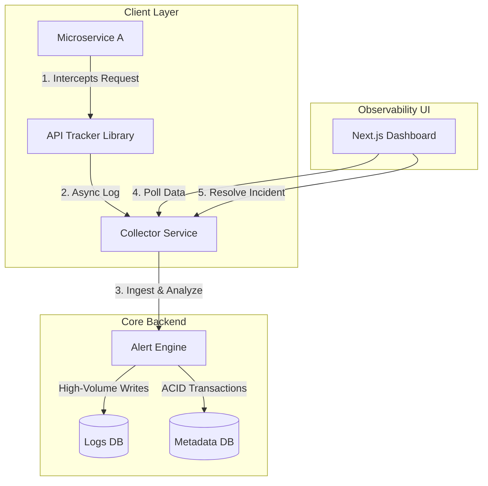

# API Observability & Monitoring Platform

> A production-grade distributed monitoring solution for tracking microservice API traffic, detecting real-time anomalies, and managing incidents with high data integrity.

[](https://spring.io/projects/spring-boot)
[](https://kotlinlang.org/)
[](https://nextjs.org/)
[](https://www.mongodb.com/)

---

## 📋 Table of Contents

- [Overview](#overview)
- [Architecture](#architecture)
- [Tech Stack](#tech-stack)
- [Database Design](#database-design)
- [Key Features](#key-features)
- [Design Decisions](#design-decisions)
- [Getting Started](#getting-started)
- [API Documentation](#api-documentation)
- [Project Structure](#project-structure)
- [Contributing](#contributing)
- [License](#license)

---

## 🎯 Overview

This platform provides comprehensive observability for microservice architectures by intercepting API calls, analyzing traffic patterns, and alerting on anomalies. Built with enterprise-grade reliability in mind, it demonstrates distributed system design patterns including dual-database strategies, optimistic locking, and asynchronous event processing.

**Core Capabilities:**
- Real-time API traffic monitoring
- Anomaly detection (slow responses, 5xx errors)
- Intelligent rate limiting with non-blocking enforcement
- ACID-compliant incident management
- JWT-secured dashboard with incident resolution workflows

---

## 🏗️ Architecture

The system employs a **distributed three-tier architecture**:



### Component Breakdown

| Component | Technology | Responsibility |
|-----------|-----------|----------------|
| **API Tracker** | Kotlin, Spring AOP | Lightweight library that intercepts requests, enforces rate limits, and ships logs asynchronously |
| **Collector Service** | Spring Boot 3, Kotlin | Core engine that ingests logs, detects anomalies (slow/5xx responses), and manages alerts |
| **Dashboard** | Next.js 14, Tailwind CSS | Real-time traffic visualization and incident resolution interface |

---

## 🛠️ Tech Stack

### Backend
- **Framework:** Spring Boot 3.x
- **Language:** Kotlin 1.9+
- **Security:** Spring Security with JWT
- **Database:** MongoDB 6.0+ (Dual-instance setup)
- **API Documentation:** SpringDoc OpenAPI (Swagger)

### Frontend
- **Framework:** Next.js 14
- **Styling:** Tailwind CSS
- **State Management:** React Hooks
- **Authentication:** JWT-based auth flow

### Infrastructure
- **Containerization:** Docker & Docker Compose
- **Orchestration:** Docker Compose for local development

---

## 🗄️ Database Design

The system implements a **dual-database strategy** for optimal performance and data integrity.

### 1️⃣ Primary Database: `logs_db`

**Purpose:** High-velocity write throughput for raw traffic data

**Collection:** `api_logs`  
**Repository:** `ApiLogRepository` (`com.monitoring.collector.repository.logs`)

```json
{
  "traceId": "550e8400-e29b-41d4-a716-446655440000",
  "serviceName": "orders-service",
  "endpoint": "/api/checkout",
  "method": "POST",
  "status": 200,
  "latencyMs": 850,
  "type": "TRAFFIC",
  "timestamp": "2023-10-27T10:15:30Z"
}
```

### 2️⃣ Secondary Database: `metadata_db`

**Purpose:** ACID compliance for critical business data

**Collections:** `incidents`, `users`  
**Repositories:** `IncidentRepository`, `UserRepository` (`com.monitoring.collector.repository.metadata`)

#### Incident Document Schema

```json
{
  "id": "inc-001",
  "type": "SLOW_API",
  "serviceName": "orders-service",
  "endpoint": "/api/v1/orders",
  "status": "OPEN",
  "version": 1,
  "resolvedBy": null,
  "createdAt": "2023-10-27T10:00:00Z",
  "resolvedAt": null
}
```

#### User Document Schema

```json
{
  "username": "admin",
  "password": "$2a$10$hashed_password",
  "roles": ["ADMIN"],
  "createdAt": "2023-10-27T09:00:00Z"
}
```

**Note:** Username uniqueness enforced via `@Indexed(unique = true)`

---

## ✨ Key Features

### 🔍 Real-Time Monitoring
- Captures all API requests via Spring AOP interception
- Asynchronous log shipping to prevent performance impact
- Sub-second latency tracking with millisecond precision

### 🚨 Intelligent Alerting
- **Slow API Detection:** Configurable latency thresholds
- **Error Rate Monitoring:** Automatic 5xx error tracking
- **Rate Limit Events:** Non-blocking rate limit hit detection

### 🔐 Security
- JWT-based authentication for dashboard access
- Role-based access control (RBAC)
- Secure password hashing with BCrypt

### 📊 Incident Management
- Structured incident lifecycle (OPEN → RESOLVED)
- Optimistic locking to prevent concurrent resolution conflicts
- Audit trail with resolver tracking and timestamps

### ⚡ Rate Limiting
- Client-side token bucket implementation
- Non-blocking design (never rejects requests)
- Marks events as `RATE_LIMIT_HIT` when threshold exceeded
- Thread-safe using `ConcurrentHashMap` and `AtomicInteger`

---

## 🧠 Design Decisions & Trade-offs

### 1. Dual MongoDB Strategy

**Rationale:** Prevent high-volume log writes from impacting critical incident operations

**Implementation:**
- Two separate `MongoTemplate` beans
- Package-based repository routing via `@EnableMongoRepositories`
- Physical database separation ensures query isolation

**Trade-off:** Increased operational complexity vs. guaranteed performance isolation

### 2. Optimistic Locking for Concurrency

**Problem:** Multiple users attempting to resolve the same incident

**Solution:** Version-based optimistic locking with `@Version` annotation

```kotlin
// Scenario
User A reads incident (version = 1)
User B reads incident (version = 1)
User A resolves → version updates to 2 ✓
User B attempts resolve → OptimisticLockingFailureException ✗
```

**Trade-off:** Requires retry logic in clients vs. guaranteed data consistency

### 3. Non-Blocking Rate Limiter

**Design:** Token bucket pattern with in-memory state

**Behavior:**
- Does NOT reject requests
- Marks events for downstream processing
- Uses epoch-second bucketing for efficient cleanup

**Implementation:**
```kotlin
ConcurrentHashMap<EpochSecond, AtomicInteger>
```

**Trade-off:** Cannot enforce hard limits vs. zero application latency impact

---

## 🚀 Getting Started

### Prerequisites

- Docker Engine 20.10+
- Docker Compose 2.0+
- 4GB available RAM

### Installation

1. **Clone the repository**
   ```bash
   git clone https://github.com/yourusername/api-observability-platform.git
   cd api-observability-platform
   ```

2. **Start all services**
   ```bash
   docker-compose up --build
   ```

3. **Wait for services to be healthy**
   ```bash
   # All services should show as "healthy"
   docker-compose ps
   ```

### Access Points

| Service | URL | Credentials |
|---------|-----|-------------|
| **Dashboard UI** | http://localhost:3000 | `admin` / `password123` |
| **Collector API** | http://localhost:8080 | - |
| **API Documentation** | http://localhost:8080/swagger-ui/index.html | - |
| **Test Endpoint** | http://localhost:8081/api/test | - |

---

## 📚 API Documentation

### Authentication

#### Login
```http
POST /api/auth/login
Content-Type: application/json

{
  "username": "admin",
  "password": "password123"
}
```

**Response:**
```json
{
  "token": "eyJhbGciOiJIUzI1NiIsInR5cCI6IkpXVCJ9...",
  "expiresIn": 3600
}
```

### Log Ingestion

#### Submit API Log
```http
POST /api/logs/ingest
Authorization: Bearer <token>
Content-Type: application/json

{
  "traceId": "550e8400-e29b-41d4-a716-446655440000",
  "serviceName": "orders-service",
  "endpoint": "/api/checkout",
  "method": "POST",
  "status": 200,
  "latencyMs": 850
}
```

### Incident Management

#### List Open Incidents
```http
GET /api/incidents?status=OPEN
Authorization: Bearer <token>
```

#### Resolve Incident
```http
PATCH /api/incidents/{incidentId}/resolve
Authorization: Bearer <token>
```

For complete API documentation, visit the Swagger UI at http://localhost:8080/swagger-ui/index.html

---

## 📁 Project Structure

```
collector/
├── config/              # Database and security configurations
│   ├── MongoConfig.kt
│   ├── SecurityConfig.kt
│   └── SwaggerConfig.kt
├── controller/          # REST API endpoints
│   ├── AuthController.kt
│   ├── LogController.kt
│   └── IncidentController.kt
├── model/               # Domain entities
│   ├── logs/           # Primary database entities
│   └── metadata/       # Secondary database entities
├── repository/          # Data access layer
│   ├── logs/           # ApiLogRepository
│   └── metadata/       # IncidentRepository, UserRepository
├── service/            # Business logic
│   ├── AlertService.kt
│   ├── AnalyticsService.kt
│   └── IncidentService.kt
├── security/           # JWT and authentication
│   ├── JwtFilter.kt
│   └── JwtUtil.kt
└── exception/          # Global exception handling

dashboard/
├── components/         # React components
├── pages/             # Next.js pages
├── styles/            # Tailwind CSS
└── utils/             # Helper functions
```

---

## 🧪 Testing

```bash
# Run backend tests
./gradlew test

# Run frontend tests
cd dashboard && npm test

# Integration tests
./gradlew integrationTest
```

---

## 🤝 Contributing

Contributions are welcome! Please follow these steps:

1. Fork the repository
2. Create a feature branch (`git checkout -b feature/amazing-feature`)
3. Commit your changes (`git commit -m 'Add amazing feature'`)
4. Push to the branch (`git push origin feature/amazing-feature`)
5. Open a Pull Request

---


 
